# Anomaly Detection and Large CSV Analysis Strategy

**Product:** FinSight  
**Status:** Architecture recommendation; not an implementation claim  
**Last updated:** 2026-08-17

## Executive Summary

FinSight should combine simple statistical methods with business rules now and treat Isolation Forest as a later, optional background detector.

Z-score and IQR are effective for a narrow question: “Is this amount unusually high or low compared with similar historical transactions?” They are fast, inexpensive, and easy to explain. They cannot reliably detect unusual combinations such as a normal-looking amount paid to a new vendor, at an unusual time, with an unexpected category and frequency.

Isolation Forest can detect those multivariable patterns without labeled examples, but it adds model lifecycle, feature-engineering, calibration, deployment, and explanation costs. It should only be added after FinSight has strong data normalization, reliable baselines, owner feedback, and evidence that existing rules miss useful cases.

For a 25,000-row CSV, FinSight should analyze every valid record, but it should not process the entire workflow as one synchronous request and must not send all records to an LLM. The system should stream or chunk validation and insertion, calculate aggregates in PostgreSQL, run anomaly analysis in background jobs, group related findings, and give an LLM only compact, privacy-aware evidence summaries for wording.

The recommended priority is:

1. Deterministic validation, duplicate detection, and data normalization.
2. IQR, robust Z-score/MAD, rolling baselines, trend/change detection, and frequency rules.
3. Reliable background import and analysis infrastructure.
4. Owner feedback and detector-quality measurement.
5. Isolation Forest in shadow mode only if it demonstrates incremental value.

---

## 1. Detection Technique Comparison

| Technique | Best at detecting | Labels required | Cost | Explainability | Execution mode | FinSight recommendation |
| --- | --- | ---: | --- | --- | --- | --- |
| Z-score | Amounts far from a stable mean | No | Very low | Excellent | Real-time or batch | Keep as one signal |
| IQR | Extreme amounts in skewed distributions | No | Low | Excellent | Real-time or batch | Use as a primary amount detector |
| Robust Z-score/MAD | Amounts far from a robust median | No | Low | Excellent | Real-time or batch | Add or prefer for skewed categories |
| Isolation Forest | Unusual combinations of multiple features | No | Moderate | Medium-low | Primarily batch | Consider later as a secondary detector |
| Local Outlier Factor | Points unusual within a local neighborhood | No | Moderate-high | Low | Batch | Usually postpone |
| One-Class SVM | Points outside a learned “normal” boundary | No anomaly labels, but clean normal data helps | High | Low | Batch | Not recommended at expected scale |
| DBSCAN | Isolated points and rare clusters | No | Moderate-high | Medium-low | Batch/exploration | Useful only for targeted analysis |
| EWMA/CUSUM or change-point rules | Persistent changes in level or behavior | No | Very low | Excellent | Real-time or scheduled | High-value addition |
| Supervised classifier | Known error/fraud classes | Yes | Moderate | Medium | Batch or real-time | Postpone until enough reliable feedback exists |

### 1.1 Z-score

Z-score measures the distance from a mean in standard deviations:

```text
z = (amount - mean) / standard deviation
```

It detects unusually large or small amounts in a stable, roughly symmetric population. It works well for repeated expenses such as rent or a supplier whose invoices are normally similar.

Strengths:

- Very fast and easy to calculate incrementally.
- Requires no labeled training data.
- Suitable for immediate checks when a transaction is created.
- Easy to explain as “higher than your normal amount.”

Weaknesses:

- Financial amounts are often skewed and do not follow a normal distribution.
- Existing outliers distort the mean and standard deviation.
- One global baseline mixes unrelated categories and vendors.
- It only recognizes the features explicitly tested, normally amount.

Use it within comparable groups such as business + transaction type + category, with vendor-specific baselines when sufficient data exists. Never interpret a high Z-score as proof of fraud or error.

### 1.2 IQR

IQR uses the middle half of a distribution:

```text
IQR = Q3 - Q1
Lower fence = Q1 - k × IQR
Upper fence = Q3 + k × IQR
```

It detects amounts outside the usual range and is more resistant than Z-score to existing extreme values. This makes it especially suitable for skewed financial transaction amounts.

Strengths:

- No normal-distribution assumption.
- No labels required.
- Low computational cost.
- Highly explainable using a usual range.

Weaknesses:

- Requires enough observations for useful quartiles.
- Still ignores timing, vendor novelty, frequency, and feature interactions.
- Broad categories can hide meaningful sub-patterns.
- Exact percentiles are less convenient to update incrementally than a mean.

IQR should be a primary FinSight amount detector. Thresholds should include both a relative deviation and a material peso difference so trivial changes are not flagged.

### 1.3 Robust Z-score using MAD

Median absolute deviation (MAD) measures distance from the median:

```text
MAD = median(|x - median(x)|)
Robust z = 0.6745 × (amount - median) / MAD
```

MAD is less sensitive to extreme historical records than standard deviation. It is inexpensive, unlabeled, and nearly as explainable as IQR. It is a strong addition for supplier, utility, inventory, and other skewed expense histories. Handle a zero MAD explicitly and require a minimum sample size.

### 1.4 Isolation Forest

Isolation Forest randomly partitions observations. Records isolated with fewer splits are considered more unusual.

Potential FinSight features include:

- Log-transformed amount.
- Amount relative to category and vendor medians.
- Day of week, day of month, and time bucket where available.
- Days since the previous similar transaction.
- Vendor/category frequency in recent windows.
- Whether the vendor or category is new to the business.
- Description quality or normalized description indicators.
- Rolling sales or expense ratios.

Strengths:

- Requires no labeled anomaly examples.
- Detects unusual combinations that one-dimensional thresholds miss.
- Scales reasonably for tens or hundreds of thousands of rows.
- Can complement deterministic detectors.

Weaknesses:

- “Unusual” is not the same as incorrect, harmful, or fraudulent.
- Results depend heavily on feature engineering and contamination settings.
- Sparse, new, or seasonal businesses may produce many false positives.
- Raw scores are not meaningful to business owners.
- It introduces a Python/scikit-learn runtime or separate model service into the current TypeScript architecture.
- Models and feature transformations must be versioned, monitored, and retrained.

Isolation Forest should not replace IQR, Z-score, duplicate rules, or validation. If introduced, run it in a background worker, initially in shadow mode. Promote its findings only after measuring the useful new findings it produces beyond the existing system.

### 1.5 Other scikit-learn techniques

**Local Outlier Factor (LOF)** finds observations with lower density than nearby observations. It can reveal local anomalies within mixed populations, but scoring, neighbor searches, sensitivity to scaling, and weak explanations make it less attractive for production. Use it only for offline experiments.

**One-Class SVM** learns a boundary around normal data. It is sensitive to feature scaling and hyperparameters, becomes expensive at large row counts, and is difficult to explain. It is not recommended for FinSight's general import path.

**DBSCAN** separates dense clusters from noise. It can help explore vendor or transaction clusters, but selecting distance and density parameters is difficult when businesses differ. It is better as a targeted analytical tool than a default detector.

**Supervised classifiers** can eventually learn from confirmed data-entry errors or dismissed findings. They require a sufficiently large, representative, consistently labeled dataset and careful protection against business-specific leakage. They should be postponed until FinSight has meaningful feedback volume.

### 1.6 Are Z-score and IQR sufficient?

They are sufficient for a first production version of amount-outlier detection, but not for anomaly detection as a whole.

The most valuable near-term combination is:

- Schema and integrity validation.
- Exact and near-duplicate rules.
- IQR plus robust Z-score/MAD for amount outliers.
- Rolling category/vendor baselines.
- Frequency and velocity rules.
- EWMA, CUSUM, or simple current-period versus prior-period change rules.
- Seasonal comparisons when enough history exists.

This combination is likely to provide more value and clearer explanations than immediately adding Isolation Forest. Isolation Forest becomes meaningful when it identifies multivariable cases these methods miss and its incremental precision is proven through owner feedback.

---

## 2. Processing a 25,000+ Row CSV

All valid rows should eventually be stored and analyzed. The work should be divided into stages and bounded chunks so a timeout or invalid row cannot fail the whole import.

### 2.1 Validation and cleaning

At file level, verify:

- File type, encoding, delimiter, header presence, size, and row-count limits.
- Required column mappings and unambiguous transaction type.
- Formula-injection risk in cells beginning with `=`, `+`, `-`, or `@` when data may later be exported.
- A stable file hash to detect accidental re-upload.

At row level, validate:

- Required fields.
- Strict and locale-aware dates; reject impossible or implausibly future dates.
- Decimal amounts, currency, sign convention, precision, and configured limits.
- Known transaction types and valid category mappings.
- Description and vendor length and normalization limits.
- Duplicate rows within the file and likely matches already in the database.

Do not silently invent values. Classify rows as valid, warning, or rejected and retain the row number and reason for every warning or rejection. Let the owner fix mapping-level problems once rather than editing thousands of rows individually.

### 2.2 Duplicate detection

Use layers:

1. **File hash:** detects an identical uploaded file.
2. **Row fingerprint:** normalized business, type, date, amount, vendor, description, and category for exact duplicates.
3. **Database idempotency key:** prevents retry or concurrent-import duplication.
4. **Near-duplicate score:** amount equality or tolerance, date proximity, normalized vendor/description similarity, and category.

Exact duplicates can be blocked or quarantined according to product policy. Near duplicates should normally be imported with a review flag, not automatically deleted.

### 2.3 Categories and missing values

Normalize case, spacing, punctuation, and known aliases before matching categories or vendors. Map unknown categories to a review queue or an explicit “Uncategorized” value. Creating new categories should require a clear import setting and should avoid case-variant duplicates.

Missing optional values can remain null. Missing required dates or amounts should reject the row. Any imputation used for analytics must never overwrite the financial record and must be clearly marked as analytical only.

### 2.4 Extreme values and data-entry errors

Apply deterministic checks before statistical analysis:

- Impossible sign or zero amount for the selected record type.
- Decimal-shift patterns such as an amount approximately 10×, 100×, or 1,000× the normal value.
- Dates far outside the rest of the import.
- Duplicate separators or locale parsing mistakes.
- Amount/currency mismatches.
- Totals inconsistent with available line-item information.

Then apply category/vendor IQR and MAD baselines. A statistically extreme record should be flagged for review, not rejected solely because it is unusual.

### 2.5 Patterns, trends, and behavioral changes

Calculate:

- Daily, weekly, and monthly expense and sales totals.
- Counts and totals by category and normalized vendor.
- Rolling 7-, 30-, and 90-day baselines.
- Period-over-period percentage and absolute changes.
- Recurring-transaction regularity.
- Transaction velocity and repeated same-day activity.
- New vendors/categories and category-mix shifts.
- Sales-to-expense and category-share changes where the underlying data supports them.
- Same-month or same-season comparisons once sufficient history exists.

Require both statistical significance and business materiality. A 200% increase from ₱10 to ₱30 is usually less important than a 30% increase worth ₱50,000.

### 2.6 Historical baseline calculation

Baselines should be business-specific and use comparable populations. Prefer the most specific group with enough samples:

```text
vendor + category + transaction type
                ↓ fallback
category + transaction type
                ↓ fallback
transaction type for the business
```

Store count, total, mean, variance inputs, median/quantiles or mergeable sketches, MAD where practical, frequency, and last-updated time. Separate an initial imported historical backfill from later live records so the backfill does not generate thousands of redundant “new” alerts.

### 2.7 Batch and stage design

Recommended import sequence:

1. Upload the file to controlled storage and create an import record.
2. Stream-parse it into a staging area in chunks, for example 1,000–5,000 rows.
3. Validate and normalize each staged row.
4. Return a preview plus aggregate error/warning counts.
5. After confirmation, insert valid records in idempotent chunks.
6. Refresh affected aggregates once per import, not once per row.
7. Queue background statistical and pattern analysis.
8. Optionally score a feature matrix with Isolation Forest later.
9. Group findings by pattern/category/vendor and rank them.
10. Notify the user when processing is complete.

Chunk size should be measured rather than hard-coded as a universal optimum. Transactions should be bounded per chunk, while the import state machine makes the overall operation resumable. Partial progress, error details, retry count, and cancellation state should be persisted.

---

## 3. Recommended FinSight Analysis Pipeline

```mermaid
flowchart LR
    A[CSV upload] --> B[Validate and stage]
    B --> C[Clean and normalize]
    C --> D[Owner preview]
    D --> E[Idempotent chunked insert]
    E --> F[Database aggregates and baselines]
    F --> G[Statistical and rule-based detection]
    G --> H[Optional ML scoring]
    H --> I[Group, rank, and suppress findings]
    I --> J[Deterministic explanation evidence]
    J --> K[Optional LLM wording]
    K --> L[User insights and feedback]
```



| Stage | What happens | Preferred technique/location |
| --- | --- | --- |
| Upload | Authenticate, limit size, hash, store, create job | Backend + object storage |
| Validation | Parse schema, dates, amounts, types, and row limits | Backend streaming parser |
| Cleaning | Trim and normalize strings; standardize dates/currency | Backend worker |
| Normalization | Resolve category/vendor aliases and row fingerprints | Backend + database |
| Preview | Show samples, mappings, counts, and grouped issues | Frontend using backend results |
| Storage | Insert valid records and preserve rejected-row evidence | Backend + PostgreSQL |
| Aggregation | Calculate daily/monthly/category/vendor summaries | PostgreSQL |
| Statistical analysis | IQR, MAD, Z-score, materiality, trends, velocity | SQL and backend worker |
| Anomaly detection | Combine detector evidence; optional Isolation Forest | Background worker; Python only if ML is adopted |
| Finding aggregation | Deduplicate, cluster, suppress, and rank findings | Backend + PostgreSQL |
| AI interpretation | Convert compact evidence into natural language | Optional LLM API |
| Presentation | Show actionable insight and accept feedback | Frontend |

An LLM must not decide financial truth, calculate authoritative totals, or determine whether a record is fraudulent. Its role is to phrase already-calculated evidence and answer questions from bounded, verified context.

---

## 4. Performance and Scalability

### 4.1 Scale tiers

| Import size | Recommended handling |
| ---: | --- |
| 1,000 | May complete quickly, but should use the same validated import pipeline |
| 25,000 | Background/resumable job, chunked insertion, database aggregation |
| 100,000 | Dedicated workers, staging tables, bulk-load strategy, incremental aggregates |
| 1,000,000+ | Object storage, streaming/bulk ingestion, partition-aware database design, distributed queue/workers, approximate quantiles where justified |

The threshold between synchronous and asynchronous work should be based on measured duration and operational limits, not only row count. Using one durable pipeline for all sizes reduces edge cases even when small imports finish almost immediately.

### 4.2 Responsibility by component

**Frontend**

- Select/upload files and configure column mapping.
- Display a bounded preview, progress, error summaries, and downloadable rejected-row report.
- Poll or subscribe to job status.
- Paginate records and grouped findings; never render tens of thousands of rows at once.
- Never perform authoritative validation or totals only in the browser.

**Backend/API and workers**

- Enforce authentication, authorization, file limits, schema rules, and idempotency.
- Stream parsing, normalization, chunk orchestration, retries, and cancellation.
- Generate deterministic explanation evidence.
- Run background analysis without holding an HTTP request open.
- Maintain detector and feature versions.

**PostgreSQL**

- Enforce constraints and tenant boundaries.
- Store staged/imported rows, fingerprints, jobs, findings, and feedback.
- Perform joins, grouping, window calculations, and aggregate refreshes.
- Maintain indexes on business, type, date, category, vendor/fingerprint, import batch, and job status as supported by query plans.
- Use summary tables or materialized/incremental aggregates for frequent dashboard queries.

**scikit-learn**

- Only create and score normalized feature matrices for detectors that demonstrably need ML.
- Run out of request path in a versioned Python worker/service.
- Persist model version, feature version, training window, score, and explanation evidence.
- Do not become a second source of truth for transactions or totals.

**AI/LLM API**

- Receive only a compact finding packet: aggregate statistics, selected example records, detector reasons, date windows, and safe business context.
- Produce structured, constrained user-facing language.
- Remain optional; deterministic templates must work when the provider fails.

### 4.3 Never send all 25,000 rows to an LLM

Sending every row is unnecessarily expensive, slow, privacy-heavy, difficult to validate, and likely to exceed useful context limits. Pre-processing should reduce the input to facts such as:

- Period totals and changes.
- Category/vendor baselines.
- Top material anomalies.
- A small number of representative records.
- Detector agreement and confidence.
- Data-quality limitations.

The database and deterministic analysis layer should calculate the facts. The LLM should only explain them.

---

## 5. Explainability and False-Alarm Control

Every visible finding should answer:

1. What happened?
2. What was it compared with?
3. How large was the difference in pesos and percent?
4. Why might it matter?
5. What should the owner do next?
6. How confident is the system, and what data limits apply?

Instead of exposing a model score:

> **Unusual Expense Detected**  
> Ingredient expenses from this supplier were usually ₱2,000–₱3,000 per transaction during the last 90 days. A ₱12,500 expense was recorded on August 14—₱9,700 above the recent median. Check whether the amount or decimal placement is correct. If this was an intentional bulk purchase, mark it as expected.

For a multivariable finding:

> **New Purchasing Pattern**  
> This amount is not unusually high by itself, but it is the fourth payment to a new supplier in two days. Similar suppliers normally appear once or twice per month. Review the transactions together.

Use deterministic reason codes and evidence fields beneath every explanation, whether the wording comes from a template or an LLM.

To reduce false alarms:

- Require minimum sample sizes and fall back to broader baselines carefully.
- Compare like with like: business, record type, category, vendor, and season where possible.
- Require material peso impact as well as a statistical threshold.
- Combine detector evidence and rank rather than displaying every signal.
- Group related imported anomalies into one insight.
- Suppress repeated alerts for the same record/pattern.
- Use severity levels and a review queue instead of alarming language.
- Allow “expected,” “incorrect,” “duplicate,” and “not useful” feedback.
- Avoid automatically deleting, recategorizing, or accusing based on anomaly scores.

The user-facing term should usually be “unusual,” “needs review,” or “different from your recent pattern,” not “fraudulent.”

---

## 6. Final Recommendation

### 6.1 Decisions

1. **Z-score/IQR only?** Use them for amount outliers, but not as the entire anomaly strategy. Prefer IQR and robust Z-score/MAD for skewed financial data, with ordinary Z-score as supporting evidence.
2. **Add Isolation Forest now?** No. First improve normalization, import reliability, baselines, explainable rules, and feedback measurement.
3. **Combine statistics and machine learning?** Eventually, if offline and shadow-mode evaluation proves meaningful incremental value. ML should be a secondary signal, not the primary decision maker.
4. **Other useful techniques?** Exact/near-duplicate fingerprints, rolling medians, MAD, frequency/velocity checks, recurring-pattern detection, EWMA/CUSUM or simple change detection, and seasonal comparisons offer the best near-term value.
5. **What happens for 25,000+ records?** Analyze every valid row through a staged, chunked, idempotent, resumable background workflow. Calculate aggregates first, then detailed findings; group results before presenting them.
6. **Overall architecture?** Thin frontend, authenticated API, durable import/anomaly jobs, PostgreSQL as the calculation and persistence foundation, optional Python ML worker, and optional LLM explanation over summarized evidence.
7. **What is worth implementing now?** Data-quality controls, idempotent imports, database fingerprints, robust statistics, materiality thresholds, aggregate tables, background jobs, grouped findings, feedback capture, and performance/accuracy monitoring.

### 6.2 Implementation order

**Implement now**

- Resumable CSV import state and progress reporting.
- Streaming validation and bounded chunk insertion.
- File hashes, normalized row fingerprints, and database-backed idempotency.
- Rejected-row reporting and category/vendor normalization.
- IQR plus median/MAD baselines with sample-size and materiality rules.
- Frequency, recurring-pattern, and period-change detectors.
- PostgreSQL-side aggregates and indexed queries.
- Grouped explanations, owner feedback, and detector metrics.

**Implement after the foundation is measured**

- Seasonal baselines for businesses with enough history.
- Approximate/mergeable quantile sketches if exact percentile refresh becomes a measured bottleneck.
- Isolation Forest shadow scoring with business-specific or cohort-aware features.
- A separate Python worker only when the model is approved for production use.

**Postpone**

- LOF and One-Class SVM in the production import path.
- Supervised anomaly classification before a reliable labeled dataset exists.
- Per-business complex models for businesses with sparse history.
- LLM analysis of raw transaction tables.
- Automatic financial corrections based solely on anomaly detection.

### 6.3 Criteria for adopting Isolation Forest

Promote Isolation Forest beyond shadow mode only if it meets pre-agreed evaluation targets:

- It finds confirmed, materially useful anomalies missed by existing rules.
- Its precision among surfaced findings is acceptable to owners.
- It does not disproportionately flag new, seasonal, or low-volume businesses.
- Training and scoring latency fit background-job targets.
- Every surfaced finding can be accompanied by understandable feature-level evidence.
- Model, feature, and training-data versions are reproducible and monitored.

The practical conclusion is that machine learning may improve FinSight, but it is not the next bottleneck. Trustworthy ingestion, robust baselines, understandable rules, and measured owner feedback will provide greater immediate accuracy and usefulness with lower complexity.
