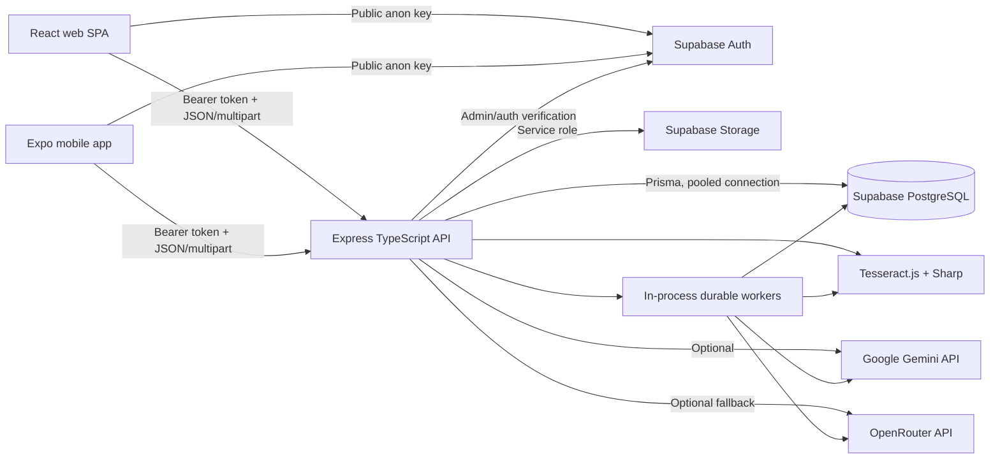
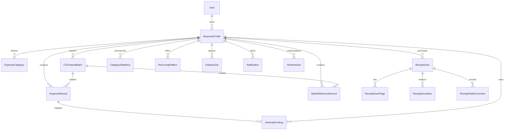

# FinSight Current-State Technical Overview and Assessment

**Assessment date:** 2026-08-07  
**Repository branch reviewed:** `feat/mobile-ui-refine`  
**Repository commit at the start of the review:** `6ac5dd9`  
**Document purpose:** Describe what is actually implemented in the current repository, how it works, what remains incomplete, and what should be improved next.

## 1. Scope, Method, and Status Definitions

This assessment was produced from the executable source code, Prisma schema and migrations, automated tests, build configuration, and deployment files. Existing prose documentation, comments, TODOs, and UI labels were treated only as leads and were not accepted as evidence that a feature works.

The review covered:

- `backend/` — API, services, workers, Prisma schema, migrations, and tests
- `web/` — React web application, API client, pages, components, and tests
- `mobile/` — Expo/React Native application, navigation, storage, screens, API client, and tests
- `.github/workflows/`, `docker-compose.yml`, `nginx/`, scripts, and project configuration
- The configured hosted Supabase database's migration status and database advisors

Status labels used throughout this document:

| Status | Meaning |
|---|---|
| **Fully implemented** | Connected end to end in the repository and covered by direct code/test evidence. This does not by itself prove that a separately hosted frontend or backend has been redeployed. |
| **Partially implemented** | A usable path exists, but important workflow, reliability, parity, or operational pieces are missing. |
| **Implemented, disabled by default** | Code, persistence, and API/UI support exist, but the detector or feature is off in the default configuration. |
| **Planned/not implemented** | No connected implementation was found. A comment, plan, placeholder, or dormant UI alone does not count. |
| **Unverified** | The repository cannot prove the external or runtime fact, such as provider availability, production deployment, backup policy, or physical-device behavior. |

### Verification performed during this assessment

- Backend TypeScript typecheck, production build, and Prisma schema validation passed.
- Backend automated tests passed: **47 files / 708 tests**.
- Web typecheck, production build, lint, and tests passed: **5 files / 75 tests**. Lint reported no errors and 22 React Fast Refresh warnings.
- The existing Playwright web test passed: **1 Chromium test** covering the public authentication shell.
- Mobile typecheck and tests passed: **15 files / 111 tests**.
- All **22** repository migrations were reported as applied to the configured hosted Supabase project.
- Supabase database advisors returned no current warning or error findings.
- A catalog query found no unindexed foreign-key columns in the public application schema.
- Production-dependency audit results: backend had no known findings; web reported two high-severity React Router package advisories; mobile reported one high and twelve moderate dependency-chain advisories. Their practical relevance is discussed in the security section.

These checks validate the current working tree, which contains uncommitted implementation work. They do not establish that every application artifact currently running in production was built from this working tree.

## 2. Executive Summary

FinSight is a small-business financial monitoring application. It centralizes expense and sales-reference records, accepts manual, CSV, and receipt-derived data, presents dashboards and deterministic financial insights, flags suspicious or unusual expense activity, and lets an owner ask an AI assistant to explain calculated results.

The repository contains a substantial connected system rather than a prototype:

- An Express/TypeScript API with Supabase authentication and storage
- A React/Vite web application
- An Expo/React Native mobile application
- A PostgreSQL database managed through Prisma migrations
- Durable database-backed receipt and anomaly-analysis jobs
- Deterministic duplicate, outlier, velocity, trend, novelty, and recurring-pattern techniques
- Optional Gemini and OpenRouter integrations for explanations, category suggestions, and receipt fallback processing

The most important current limitations are reliability boundaries, not a lack of screens. Receipt confirmation and CSV confirmation span several writes without a single transaction or robust idempotency boundary. Password-reset email initiation exists, but neither client implements the recovery-token-to-new-password completion flow. Several newer anomaly detectors are disabled by default, and parts of their configuration are not honored. Exact duplicate checking is vulnerable to concurrent read-before-write races. Production application deployment, backups, restore testing, monitoring, and live AI-provider behavior are **Unverified**.

No scikit-learn, Isolation Forest, trained anomaly model, embedding model, or custom machine-learning training pipeline is present. The current anomaly design intentionally uses explainable statistics, similarity functions, rolling windows, and rules.

## 3. System Overview

### 3.1 Purpose

FinSight helps a business owner record day-to-day financial activity and understand whether spending, sales-reference activity, and cash-flow behavior are within expected ranges. The product emphasizes monitoring and explanation rather than accounting, banking, tax filing, or financial advice.

### 3.2 Target users

The implemented authorization and UX model supports one principal user type:

- A small-business owner who manages one or more business profiles

The schema has a single application user entity and no organization memberships, employee accounts, accountants, administrator roles, or permission matrix. Multi-user business collaboration is therefore **not implemented**.

### 3.3 Main problems addressed

- Consolidating expense and sales-reference records from manual entry, CSV files, and receipts
- Reducing manual receipt transcription through OCR and structured extraction
- Detecting exact duplicates and surfacing records that require review
- Explaining unusual amounts and behavior using understandable statistical reasons
- Monitoring spending against owner-provided monthly expectations and available funds
- Converting calculated financial context into plain-language AI explanations
- Preserving source provenance through receipt scans, line items, and imported CSV batches

### 3.4 Current architecture



Key implementation locations:

- API construction and middleware: `backend/src/app.ts`
- Process startup and worker lifecycle: `backend/src/server.ts`
- Database model: `backend/prisma/schema.prisma`
- API route modules: `backend/src/routes/`
- Business logic: `backend/src/services/`
- Anomaly system: `backend/src/services/anomalyDetection/`
- Web routing and screens: `web/src/App.tsx`, `web/src/pages/`
- Mobile navigation and screens: `mobile/src/navigation/`, `mobile/src/screens/`
- Shared client API wrappers: `web/src/lib/api.ts`, `mobile/src/lib/api.ts`

### 3.5 Overall workflow

1. A user registers or signs in through Supabase Auth.
2. The backend validates the Supabase bearer token and resolves it to the corresponding `User` row.
3. The user creates or selects a `BusinessProfile`, which acts as the tenant boundary for financial records.
4. Records arrive through manual entry, CSV confirmation, or receipt confirmation.
5. Deterministic checks create legacy duplicate/large-expense flags and enqueue durable anomaly work.
6. Background workers claim database jobs, calculate findings, statistics, and recurring patterns, and generate high-severity notifications where configured.
7. Dashboards, records, insights, notifications, and AI context query the resulting business-scoped data.
8. The owner can confirm, dismiss, resolve, or otherwise review applicable findings and duplicates.

## 4. Current Features

### 4.1 Authentication and account management

| Feature | Status | Current behavior and evidence |
|---|---|---|
| Registration and login | **Fully implemented** | Supabase Auth provides identity; a corresponding Prisma `User` record is maintained by `backend/src/services/auth.service.ts`. Web and mobile clients maintain authenticated sessions. |
| Current-user profile | **Fully implemented** | `/api/v1/auth/me` returns the backend user and avatar data through `backend/src/controllers/auth.controller.ts`. |
| Avatar upload | **Fully implemented** | Images are uploaded through the backend to Supabase Storage; clients display signed URLs. |
| Change password | **Fully implemented** | Requires the current password before updating the Supabase password. |
| Logout | **Fully implemented** | The backend can revoke sessions globally through Supabase admin APIs; clients also clear local session state. |
| Delete account | **Partially implemented** | Storage, Auth, and database deletion are connected, but they cannot be committed atomically across Supabase Auth, Storage, and PostgreSQL. A failure after Auth deletion can leave residual database state. |
| Request password reset | **Partially implemented** | The backend calls Supabase `resetPasswordForEmail`, and both clients expose the request screen. No client handles the recovery callback/session and no screen completes the new-password operation. |
| Email verification | **Planned/not implemented** | Registration currently creates users with `email_confirm: true`; no verification workflow is enforced. |
| MFA, RBAC, administrator roles | **Planned/not implemented** | No corresponding schema, middleware, or connected UI was found. |

### 4.2 Business profiles and configuration

| Feature | Status | Current behavior and evidence |
|---|---|---|
| Multiple business profiles | **Fully implemented** | Owners can create, list, view, edit, switch, archive, and restore profiles through `backend/src/services/businessProfile.service.ts` and corresponding web/mobile screens. |
| Business logo | **Fully implemented** | Uploaded through the API to Supabase Storage and returned using signed access. |
| Financial assumptions | **Fully implemented** | Profiles hold expected monthly expenses, expected monthly sales, operating days, available funds, and owner-selected thresholds used by dashboard and spending-impact calculations. |
| Team membership and shared profiles | **Planned/not implemented** | `BusinessProfile` belongs to one `User`; no membership relation exists. |

### 4.3 Categories

| Feature | Status | Current behavior and evidence |
|---|---|---|
| Create and list expense categories | **Fully implemented** | Connected API and client flows exist. CSV import can also create missing categories. |
| Update/delete/merge categories | **Planned/not implemented** | No connected route or service was found. |
| Uniqueness per business | **Partially implemented** | Application logic tries to reuse names, but the database has no case-insensitive unique invariant, so concurrent or case-variant duplicates remain possible. |

### 4.4 Expense and sales-reference records

| Feature | Status | Current behavior and evidence |
|---|---|---|
| Manual expense CRUD | **Fully implemented** | Business-scoped create, read, update, and delete operations are exposed in `backend/src/routes/expenseRecord.routes.ts`. |
| Manual sales-reference CRUD | **Fully implemented** | Equivalent sales-reference operations exist. These records should not be described as formal accounting revenue. |
| Record source/provenance | **Fully implemented** | Records retain manual, CSV, or receipt origin and can link back to an import batch, receipt scan, or scan line item. |
| Unified search and filtering | **Fully implemented on web; partial on mobile** | The records API supports record type, date, category, keyword, source, and import-batch filters with cursor pagination. Web global search also combines local navigation entities with debounced record search; mobile has record filtering but no equivalent global search. |
| Exact duplicate detection | **Fully implemented with concurrency limitation** | Same-business date, amount, and case-insensitive description comparisons point copies to the oldest record and create review state/notifications. It is a read-before-write check without a database uniqueness guarantee, so simultaneous identical requests can both pass. |
| Duplicate review and bulk actions | **Fully implemented** | Owners can keep or discard flagged duplicates through records endpoints and client review UI. |
| Large-expense flag | **Fully implemented** | Compares an expense to a profile threshold derived from expected monthly expenses and creates a notification. The product wording should make this basis clear because it is not a cash-balance calculation. |
| General record export | **Planned/not implemented** | Source CSV files can be downloaded, but no current filtered-record export was found. |

### 4.5 CSV import

| Feature | Status | Current behavior and evidence |
|---|---|---|
| CSV upload and preview | **Fully implemented on web** | `backend/src/services/csvImport.service.ts` parses headers, samples rows, supports mapping, validation, and preview. |
| Expense and sales import | **Fully implemented on web; partial on mobile** | Web supports both types and vendor mapping. Mobile currently focuses on expense import and exposes fewer mapping and correction controls. |
| Row validation and skipped-row correction | **Fully implemented on web; partial on mobile** | Web shows skipped rows and supports corrections. Mobile lacks equivalent detailed correction and table-preview UX. |
| Category creation during import | **Fully implemented** | Missing mapped categories may be created before bulk record insertion. |
| Duplicate and large-expense checks | **Fully implemented** | Imported expenses receive the same legacy flags and notifications. |
| Atomic import confirmation | **Partially implemented** | Storage upload, batch creation, category creation, record insertion, status update, and notification work do not share one transaction or resumable workflow. A mid-flow failure can leave a partial batch, orphaned object, categories, or inserted records. |

### 4.6 Receipt scanning and document processing

| Feature | Status | Current behavior and evidence |
|---|---|---|
| Multi-page receipt upload | **Fully implemented** | Up to eight pages are accepted and represented by `ReceiptScan` and `ReceiptScanPage`. |
| Image quality check | **Partially implemented** | Sharp-based brightness and sharpness checks are connected. Glare detection is explicitly not implemented because a reliable metric/corpus was not established. |
| Durable OCR processing | **Fully implemented** | Database-backed leases, heartbeat fields, retries, stale-lease recovery, and atomic row claims are implemented in `backend/src/services/receiptScan.service.ts`. |
| Local OCR | **Fully implemented** | Sharp preprocessing plus Tesseract.js OCR runs locally; numeric and structural fields are extracted by deterministic rules. |
| Vision rescue | **Fully implemented when configured** | Difficult scans may use Gemini vision after deterministic quality/readability checks. The provider call has a 20-second abort timeout and strict response validation. Live provider availability is **Unverified**. |
| Receipt field and line-item review | **Fully implemented** | Owners can correct dates, vendor, totals, items, and categories, delete false items, and add missing ones. Corrections are retained for offline evaluation. |
| Receipt-to-expense confirmation | **Partially implemented** | It performs integer-centavo reconciliation and creates category-grouped expenses, but the item updates, multiple expense creates, links, notifications, jobs, and final scan status are not in one transaction. A failure halfway can create partial or duplicate expenses on retry. |
| Source deletion cleanup | **Partially implemented** | Reference counting prevents premature deletion of shared source files, but Storage deletion is best effort and may leave orphaned objects during an outage. |

### 4.7 Dashboard, analytics, and insights

| Feature | Status | Current behavior and evidence |
|---|---|---|
| Dashboard totals and category distribution | **Fully implemented** | The dashboard service calculates period expense/sales totals, category distribution, trends, alerts, and review counts. |
| Cash-flow series | **Fully implemented** | Daily and monthly series are exposed; mobile uses the dedicated cash-flow endpoint. |
| Recovery target | **Fully implemented** | A deterministic remaining-target and remaining-operating-day calculation produces an adjusted daily target and status. |
| Spending impact simulator | **Fully implemented** | Planned spending is compared with available funds and the owner-configured threshold; no transaction is created. |
| Expense behavior comparison | **Fully implemented** | Current and previous periods, category movements, and unusual expenses are calculated in `backend/src/services/insights.service.ts`. |
| Formal profit, accounting statements, forecasting | **Planned/not implemented** | The system compares expense and sales-reference data but does not implement recognized accounting, tax, or forecast models. |

### 4.8 Persistent anomaly detection

| Detector/capability | Status | Current behavior |
|---|---|---|
| Unified findings and owner feedback | **Fully implemented** | `AnomalyFinding` stores type, severity, score, reasons, metadata, detector version, status, and owner feedback. APIs and web/mobile panels list and review findings. |
| Durable analysis jobs | **Fully implemented** | `AnalysisJob` supports idempotency keys, leasing, retry/backoff, stale-job recovery, and bounded claims. |
| Amount outlier | **Fully implemented and enabled by default** | Uses recent same-category history, minimum sample size, leave-one-out Z-score and Tukey IQR checks, and a material-deviation floor. |
| Near duplicate | **Implemented, disabled by default** | Scores amount, vendor, description, date proximity, and category using configurable weighted deterministic similarity. |
| Velocity/frequency | **Implemented, disabled by default** | Compares 1-, 7-, and 30-day vendor/category counts with medians from prior windows. |
| Trend/change | **Implemented, disabled by default** | Compares current and previous 7- or 30-day totals with relative and peso-materiality thresholds. |
| Behavioral novelty | **Implemented, disabled by default** | Combines amount, vendor, category, weekday, and description novelty against bounded recent history. |
| Recurring-pattern discovery and changes | **Partially implemented** | Weekly, monthly, and quarterly cadence inference and review are connected. However, the declared recurring feature flag is not checked, so profile refreshes run it regardless of configuration; stale inferred patterns are not comprehensively retired. |
| Exact duplicate feature flag | **Partially implemented** | A configuration flag exists but the legacy exact duplicate path does not consult it. |
| Notification severity configuration | **Partially implemented** | A minimum-severity setting exists, but worker logic currently hard-codes notifications to high severity. |
| Evaluation metrics | **Partially implemented** | Backend metrics endpoints exist, but no client dashboard consumes them. Some lifecycle behavior can distort latency metrics, discussed below. |
| Isolation Forest/scikit-learn/learned anomaly model | **Planned/not implemented** | No Python service, scikit-learn dependency, trained model, model registry, inference endpoint, or embeddings pipeline exists. |

Operationally important behavior: on API startup, the anomaly worker can enqueue daily profile jobs and historical expense records without an `AnalysisJob`, up to configured bounds. This makes deployment a possible backfill event. Idempotency limits duplicate jobs, but rollout volume, notifications, and provider/database load should be measured before enabling the disabled detectors.

### 4.9 Notifications

| Feature | Status | Current behavior and evidence |
|---|---|---|
| In-app notifications | **Fully implemented** | Possible duplicate, large expense, needs-review, and anomaly notifications are business-scoped and can be listed, marked read, or all marked read. |
| Email, SMS, and push notifications | **Planned/not implemented** | No delivery service, device-token storage, or outbound notification worker was found. |
| Notification preference controls | **Planned/not implemented** | No per-user or per-business channel/type preference model exists. |

### 4.10 Help and public content

- **Fully implemented:** static FAQs, tutorial text, privacy/terms content, and contact email links.
- **Planned/not implemented:** blog content and tutorial videos are explicit placeholders; no support-ticket backend exists.

## 5. Technology Stack

### 5.1 Frontend

| Area | Current technology |
|---|---|
| Web application | React 19, TypeScript, Vite, React Router DOM |
| Web styling/UI | Tailwind CSS, Lucide icons, custom components, responsive/dark-mode styling |
| Web visualization | Recharts |
| Web HTTP | Axios |
| Mobile application | Expo, React Native, React 19, TypeScript |
| Mobile navigation | React Navigation |
| Mobile device integration | Expo SecureStore, image picker, document picker, haptics, SVG |
| Web testing | Vitest, Testing Library, Playwright |
| Mobile testing | Vitest plus source-contract and pure-function tests |

Exact declared and resolved versions should be read from `web/package.json`, `web/package-lock.json`, `mobile/package.json`, and `mobile/package-lock.json`; lockfiles are the installation source of truth.

### 5.2 Backend

| Area | Current technology |
|---|---|
| Runtime/API | Node.js, TypeScript, Express 4 |
| ORM/database client | Prisma 6 |
| Validation | Zod |
| Authentication/storage client | `@supabase/supabase-js` |
| File upload and CSV | Multer, `csv-parse` |
| Image/OCR | Sharp, Tesseract.js |
| Security/logging | Helmet, CORS, Pino, `pino-http` |
| Testing | Vitest, Supertest, PostgreSQL integration test database |

### 5.3 Database and external services

- PostgreSQL hosted in Supabase
- Supabase Auth for user identity and sessions
- Supabase Storage for avatars, logos, receipt images, and imported CSV source files
- Google Gemini API for conversational explanations, receipt category assistance, and vision rescue
- OpenRouter as a conversational/category fallback using an Anthropic model identifier

The code currently requests Gemini model `gemini-3.5-flash-lite` and OpenRouter model `anthropic/claude-haiku-4.5`. Whether those identifiers, account entitlements, quotas, and API keys work in the live environment is **Unverified**. They should be smoke-tested through provider APIs before a release.

### 5.4 Development and infrastructure

- npm workspaces are not used; backend, web, and mobile maintain separate package manifests/lockfiles.
- GitHub Actions runs Node 22 with PostgreSQL 16 in `.github/workflows/ci.yml`.
- `backend/Dockerfile` is a multi-stage Node 24 Bookworm build.
- `docker-compose.yml` and `nginx/` provide a containerized backend/reverse-proxy setup.
- Prisma migrations manage the application schema.
- Environment templates live in `.env.example` files; `.gitignore` excludes real environment files.
- No repository evidence selects a single production frontend/backend hosting provider. Current production deployment topology is **Unverified**.

CI currently omits several useful gates: backend production build/Prisma validation, web production build, Playwright tests, dependency audit policy, and a native Expo build.

## 6. AI and Intelligent Features

### 6.1 What is genuinely model-powered

| Feature | Provider/model path | Input → processing → output |
|---|---|---|
| Ask FinSight | Gemini primary; OpenRouter fallback | Authenticated question + selected module + fresh deterministic business context + six prior turns → constrained prompt, temperature 0.3, 400-token response → stored `AIInteraction` and displayed explanation. |
| Receipt category assistance | Gemini primary; OpenRouter fallback | Extracted item text/vendor + up to 20 existing categories → prompt requiring an exact existing category or uncategorized result → validated category assignment/proposal. |
| Receipt vision rescue | Gemini vision | Preprocessed difficult receipt page → strict extraction prompt with timeout → validated JSON containing document fields and up to 100 items. |
| Category suggestion endpoint | Gemini/OpenRouter | Description/vendor and allowed categories → temperature-0 short response → exact-list validation or `null`. |

Primary implementation locations are `backend/src/services/ai.service.ts`, `backend/src/services/aiContext.service.ts`, and the receipt processing/categorization services under `backend/src/services/`.

The assistant prompt instructs the model to use only the supplied numeric context, explain rather than advise, and avoid inventing facts. If both providers fail, the API returns a provider-unavailable placeholder that clients label as such. This is a good failure mode, but model compliance is probabilistic rather than guaranteed.

The API permits a limited caller-supplied context string in addition to fresh server context. Since the authenticated caller can alter that string, it should be treated as untrusted prompt content and never as authoritative calculated data.

### 6.2 Features that look like AI but are deterministic

The following are rules, algorithms, or statistics—not trained AI:

- Tesseract OCR itself is a pretrained OCR engine, but receipt field selection and numeric extraction are deterministic regular expressions, scoring, and heuristics.
- Planned-expense extraction from a question is regex/cue based; the amount is passed into the deterministic spending-impact simulator. The LLM only explains the result.
- Exact duplicate detection is deterministic field matching.
- Near-duplicate detection uses hand-set feature weights and string/date/amount similarity.
- Amount outliers use Z-score and IQR rules.
- Velocity, trend, behavioral novelty, and recurring-change detection use rolling windows, medians, thresholds, and similarity functions.
- Recovery targets, cash flow, dashboard totals, and spending impact are arithmetic calculations.
- Receipt total reconciliation uses integer arithmetic and a largest-remainder allocation method.

This distinction matters in product copy: these features are explainable automated monitoring, not fraud classification or machine-learning predictions.

### 6.3 AI reliability, privacy, and operational gaps

- No provider request timeout was found for the general conversational/category calls; only the receipt vision path has an abort timeout.
- No provider circuit breaker, per-provider health metric, spend budget, or cost dashboard exists.
- AI interactions and financial context are sent to third parties when enabled. The repository does not prove production data-processing agreements, retention configuration, or user consent language; these are **Unverified**.
- Prompt defenses reduce hallucination but do not guarantee factual output. Deterministic calculations should remain the source of displayed numbers.
- No live-provider regression suite runs in CI. Offline OCR and prompt-quality fixtures exist, but current real-provider quality is **Unverified**.
- No model/version observation is stored with every conversational response beyond the provider metadata currently captured; a formal model-quality and rollout registry is absent.

## 7. Techniques and Algorithms

### 7.1 OCR and document processing

1. Multer accepts image files in memory, with per-file limits.
2. Sharp reads image metadata, auto-rotates EXIF orientation, downsizes to a maximum dimension without upscaling, and creates a grayscale OCR input.
3. Sharp-derived brightness and sharpness measures inform quality warnings.
4. Tesseract.js produces text and OCR confidence.
5. Deterministic parsers score candidate date, vendor, total, tax, and line-item values using position, labels, formats, and consistency.
6. Adjacent pages are checked for likely duplicate content using normalized token overlap.
7. When the deterministic output meets rescue criteria, an optional Gemini vision call may return a strictly validated structured result.
8. The owner reviews and corrects the extracted fields before financial records are created.

File MIME and extension are checked, but binary magic-byte/type validation is not performed before Storage/OCR processing. Malformed or disguised content is generally rejected later by Sharp/Tesseract, which is less precise and can waste processing resources.

### 7.2 Data extraction and normalization

- Date and currency parsing handles common textual formats and normalizes monetary values to decimal database fields.
- CSV headers are user-mapped rather than assumed; invalid rows are separated and can be corrected on web.
- Vendor and description strings are trimmed/normalized for matching.
- Receipt confirmation uses centavos for allocation to avoid floating-point rounding drift.
- Positive taxes/charges can be assigned separately; negative discounts are proportionally distributed.

### 7.3 Categorization

- Owners select categories manually for direct entry.
- CSV imports map a category column and can create missing categories.
- Receipt items can be assigned by an LLM, but output must match an existing allowed category; otherwise the item remains uncategorized or presents a proposal for owner review.
- Recent vendor/category history is used as grounding context.
- There is no learned classifier trained on owner corrections, even though correction data is retained.

### 7.4 Duplicate detection

**Exact duplicate:** same business profile, transaction date, amount, and case-insensitive normalized description. Copies link to an oldest matching record and are never automatically deleted.

**Near duplicate:** bounded candidates within seven days and approximately ten percent of amount are scored with initial weights:

- Amount similarity: 35%
- Vendor similarity: 25%
- Description similarity: 20%
- Date proximity: 15%
- Category equality: 5%

Text similarity uses normalized character-bigram Sørensen–Dice-style overlap. Scores at or above 0.75 become review candidates and at or above 0.90 are high-confidence candidates by default. The detector is disabled by default.

### 7.5 Amount outlier detection

- Uses same-category history from a bounded rolling period.
- Requires at least eight historical points.
- Excludes the candidate from its own baseline.
- Calculates sample standard deviation and absolute Z-score.
- Calculates first quartile, third quartile, IQR, and Tukey fences using a 1.5 multiplier.
- Requires a Z-score above 2 or an IQR breach, plus a material deviation of at least 15%.

The same core technique appears in on-demand expense insights and the persistent finding pipeline. There is no Isolation Forest or multivariate learned boundary.

### 7.6 Velocity, trend, novelty, and recurrence

- **Velocity:** current vendor/category counts in 1-, 7-, and 30-day windows are compared with the median of four prior windows, with minimum-count and multiplier gates.
- **Trend:** current 7- or 30-day category totals are compared with the preceding window, requiring both percentage and peso materiality.
- **Behavioral novelty:** combines unusual amount, unseen/rare vendor, category, weekday, and description signals. Because records store dates rather than transaction timestamps, the timing signal is weekday novelty, not time-of-day behavior.
- **Recurring patterns:** exact normalized description/vendor/category groups are inspected for 5–9-day weekly, 25–35-day monthly, or 80–100-day quarterly intervals. At least three observations and confidence of 0.7 are required. Confirmed patterns can generate missing, early-repeat, or amount-change findings.

The exact grouping makes recurrence explainable but can miss vendors whose descriptions vary between transactions.

### 7.7 Financial calculations

- Dashboard totals aggregate expense and sales-reference records for a requested period.
- Recovery uses expected monthly sales minus month-to-date sales, clamped at zero, divided across an approximation of remaining operating days.
- Spending impact divides the proposed amount by available funds and compares it with the profile threshold. Bands are Low, Noticeable, and High.
- Cash-flow series aggregates by day or month.
- Trend and category distributions compare adjacent periods.

These are monitoring calculations based on user-entered data and assumptions. They are not audited financial statements or financial advice.

### 7.8 Validation, search, and pagination

- Zod validates most request bodies, parameters, date formats, limits, and positive amounts.
- Authentication middleware resolves bearer tokens and business services enforce owner/business scope.
- Multer enforces upload size and declared type/extension allowlists.
- Unified record listing uses keyset/cursor pagination, which is appropriate for large histories.
- Search uses case-insensitive substring matching. Without trigram/full-text indexes, broad keyword search can degrade as record volume grows.
- Several insights deliberately cap lookback rows, while recurring discovery can inspect up to 10,000 records per profile. These controls bound memory but can make old history invisible to a detector by design.

## 8. API Surface

All application routes are mounted under `/api/v1` in `backend/src/app.ts`.

| Module | Main capabilities |
|---|---|
| `auth` | Register, login, logout, recovery request, change password, current user, avatar, account deletion |
| `business-profiles` | Create, list, get, update, logo, archive, restore |
| `categories` | Create and list |
| `expenses`, `sales` | Business-scoped CRUD |
| `records` | Unified filtering/search, flagged records, duplicate review/bulk resolution |
| `receipts` | Quality check, upload, status polling, retry, item deletion, confirmation |
| `csv` | Preview, confirm, batch listing, source preview/download metadata |
| `dashboard` | Summary and cash-flow series |
| `notifications` | List, read one, read all |
| `insights` | Expense behavior, recovery, spending impact, findings, recurring patterns, evaluation metrics |
| `ai` | Ask FinSight, interaction history, category suggestion |

Public health endpoints include liveness and readiness. Readiness checks database connectivity and reports receipt/analysis queue counts. Exposing detailed failed/queued counts publicly may disclose operational state and should be reconsidered.

## 9. Database and Data Flow

### 9.1 Main entities

The Prisma schema currently defines 17 application models:

| Entity | Purpose and important relationships |
|---|---|
| `User` | Application identity linked to Supabase Auth by UUID; owns profiles, notifications, and AI interactions. |
| `BusinessProfile` | Primary tenant root; owns financial data, categories, scans, imports, notifications, findings, statistics, patterns, and jobs. |
| `ExpenseCategory` | Business-scoped expense classification. |
| `ExpenseRecord` | Expense fact; optionally links to category, receipt scan/item, CSV batch, exact duplicate, findings, and analysis jobs. |
| `SalesReferenceRecord` | Sales-reference fact; optionally links to a CSV batch and duplicate record. |
| `ReceiptScan` | Receipt processing aggregate with status, extracted totals, source ownership, and confirmation state. |
| `ReceiptScanPage` | Per-page storage path, OCR text/confidence, ordering, and image-quality data. Lease, retry, heartbeat, and failure state are held by the parent `ReceiptScan`. |
| `ReceiptScanItem` | Extracted/reviewed receipt line item; may link to category and created expense. |
| `ReceiptFieldCorrection` | Owner correction and source/confidence feedback. |
| `CSVImportBatch` | Stored source CSV, mapping, batch type/status, and import counts. |
| `Notification` | Business/user-scoped in-app alert with read state. |
| `AIInteraction` | Stored question, response, module, and related AI metadata. |
| `AnomalyFinding` | Unified persistent detector output and review feedback. |
| `CategoryStatistics` | Precomputed category/window summary values. |
| `RecurringPattern` | Inferred and owner-reviewed cadence state. |
| `AnalysisJob` | Durable anomaly work queue with lease/retry/idempotency data. |
| `ApiRateLimit` | Database-backed production rate-limit windows. |

### 9.2 Relationship overview



### 9.3 Data-flow examples

**Manual expense**

```text
Client form → Zod/API auth → owner/business validation → exact duplicate and
large-expense checks → ExpenseRecord → notification(s) → AnalysisJob →
detectors → AnomalyFinding → Insights/Records/AI context
```

**Receipt**

```text
Client files → API validation → Supabase Storage + ReceiptScan/Page rows →
durable page worker → Sharp/Tesseract → optional Gemini rescue/category →
reviewed items → reconciliation → ExpenseRecord rows → anomaly jobs
```

**CSV**

```text
Client file → parser/preview/mapping → validation/corrections → Storage +
CSVImportBatch → category lookup/create → bulk expense or sales rows →
flags/notifications/jobs → batch completion
```

**Ask FinSight**

```text
Question/module → authenticated business lookup → deterministic dashboard,
insight, finding, or simulation context → constrained provider prompt →
validated/fallback response → AIInteraction history → client display
```

### 9.4 Database design assessment

Strengths include explicit foreign keys, cascades aligned with tenant deletion, decimal money fields, useful tenant/date/status indexes, durable job tables, and deny-by-default Data API access. All public-schema foreign keys currently have supporting indexes.

Important limitations:

- Several lifecycle fields are free-form strings rather than enums or database `CHECK` constraints, including review, duplicate, scan, import, notification, user, and AI-module statuses.
- Category names have no case-insensitive per-business unique constraint.
- Exact duplicate prevention has no concurrency-safe database invariant or idempotency key.
- `CategoryStatistics` is refreshed but the amount and trend detectors still recalculate from raw bounded history, so the precomputation does not yet deliver its intended query reduction.
- JSON reasons/metadata keep findings flexible but make aggregate analysis and indexing of individual signals harder.

## 10. Security Assessment

### 10.1 Existing measures

- Supabase bearer-token authentication; the backend verifies the token with Supabase and resolves a database user.
- Supabase service-role credentials remain server-side; clients receive only a public anon key.
- Business services consistently query by owner/business identifiers rather than accepting unrestricted IDs.
- All application tables have row-level security enabled. Direct `anon` and `authenticated` table access is revoked; `service_role` has required access.
- Helmet security headers, disabled `X-Powered-By`, exact CORS allowlist, request IDs, and structured Pino HTTP logs are configured.
- Sensitive header/body keys are redacted from HTTP logs.
- Production rate limits are stored in PostgreSQL, so they survive process restarts and work across replicas. Tests use an in-memory substitute.
- Password changes require current-password verification; account deletion reauthenticates.
- Upload sizes and declared media types are limited.
- API validation uses Zod broadly and Prisma tagged SQL is parameterized in production paths.
- Hosted Supabase advisors currently report no warnings/errors, migrations are current, and public foreign keys are indexed.
- Mobile session data is chunked into Expo SecureStore.

### 10.2 Authorization model and RLS nuance

The current RLS configuration is intentionally deny-by-default for direct client Data API access: there are no end-user policies, and grants are restricted. The backend uses privileged service-role/database access, which bypasses those user-level protections. Therefore, tenant isolation ultimately depends on every backend query applying owner/business constraints correctly.

This is secure when consistently maintained, but it has a large blast radius for a missed filter. Add automated cross-tenant tests for every new endpoint and consider database session claims plus user-aware RLS if direct client access or a less-privileged backend role is introduced later.

### 10.3 Key and secret management

- Real `.env` files are ignored; templates contain placeholders and the committed backend test environment contains fake credentials.
- No credible live secret pattern was found in tracked source during this review.
- Runtime keys, rotation cadence, deployment secret store, provider restrictions, and breach response are **Unverified** because they are outside the repository.

### 10.4 Security weaknesses and risks

1. **Proxy-aware IP rate limiting is not configured.** `backend/src/app.ts` does not set a trusted proxy policy, while nginx forwards client IP headers. In a proxied deployment, `req.ip` may be the proxy address, causing unrelated users to share login/register/recovery quotas. This is both an availability and abuse-control issue; the exact safe setting depends on the deployment hop topology.
2. **Email addresses are auto-confirmed.** `backend/src/services/auth.service.ts` creates accounts with `email_confirm: true`, removing proof of mailbox ownership and increasing account abuse/recovery risk.
3. **Password recovery cannot be completed in the clients.** A user can receive a link but has no connected callback/set-password workflow.
4. **Multi-step writes are not atomic/idempotent.** Receipt and CSV confirmation can partially persist. Account deletion crosses Auth, Storage, and PostgreSQL without a durable saga.
5. **Upload type checking trusts metadata.** Actual file signatures are not checked before files enter resource-intensive processing.
6. **Web sessions use Supabase's browser persistence.** This is conventional for a SPA, but a successful XSS can access session tokens. A strict Content Security Policy and dependency hygiene are important. The exact deployed CSP is **Unverified**.
7. **AI data governance is unverified.** Financial context can be sent to Gemini/OpenRouter. Consent, retention, residency, vendor agreements, and deletion guarantees are not established by code.
8. **Readiness exposes queue state.** Public failed/queued counts provide unnecessary operational information.
9. **No MFA, role separation, security audit log, or admin control plane** exists.
10. **Backups and recovery are unverified.** The repository does not prove PostgreSQL point-in-time recovery configuration, Storage backups, retention, or a tested restore drill.

### 10.5 Dependency findings

- **Backend:** no known production dependency vulnerabilities were reported.
- **Web:** the audit reported two high React Router/React Router DOM entries for a React Server Components CSRF advisory. This project is a client-rendered Vite SPA and does not use React Server Components or Server Actions, so exploitability appears unlikely in the current architecture. This is an inference, not a vendor waiver; update to a compatible patched release and rerun tests.
- **Mobile:** one high `js-yaml` CPU-exhaustion advisory and twelve moderate advisories appeared through Expo/build tooling chains. npm's automatic proposal would force an incompatible Expo downgrade, so do not apply it blindly. Use `expo doctor`, upgrade through a supported Expo SDK path, and verify a native build.

## 11. Current Strengths

- **Explainability first:** anomaly findings preserve method, version, score, reasons, and metadata instead of presenting an opaque fraud label.
- **No unnecessary ML dependency:** current transaction techniques are deterministic, testable, and suitable for limited per-user history.
- **Strong backend test depth:** 708 passing tests cover API integration, OCR fixtures, anomaly detectors, jobs, tenant boundaries, and a 100,000-record performance scenario.
- **Durable job design:** receipt and analysis work use database leasing, retry/backoff, stale recovery, and `SKIP LOCKED`, which is much safer than untracked promises.
- **Owner review remains authoritative:** duplicate, anomaly, category, and receipt decisions are surfaced for review rather than automatically deleting or reclassifying financial data.
- **Good source provenance:** receipt pages/items, corrections, and CSV batches remain connected to resulting records.
- **Money reconciliation uses integer units:** largest-remainder allocation avoids centavo loss and floating-point drift.
- **Large-history record browsing uses cursor pagination.** This is the right foundation for users with years of transactions.
- **Database hygiene is currently good:** applied migrations, indexed foreign keys, RLS enabled, and clean hosted database advisor results.
- **Privacy-aware provider fallback:** deterministic calculations remain server-side, external calls are optional, and provider failure is explicitly shown rather than fabricated.
- **Client UX foundations:** web route lazy loading, error boundaries, dark mode, skeleton/empty states, reduced-motion handling, mobile SecureStore, and central scan workflow are present.

## 12. Problems and Areas for Improvement

### 12.1 Reliability and data integrity

- `backend/src/services/receiptScan.service.ts` confirms multiple records and updates item/scan state without one database transaction or confirmation idempotency key. Retrying an ambiguous failure can duplicate data.
- `backend/src/services/csvImport.service.ts` coordinates Storage and several database stages synchronously without a resumable state machine or compensation logic.
- Manual create flows can persist a record and then fail while creating follow-up notification work, returning an ambiguous error to the client.
- Exact duplicate detection in `backend/src/services/expenseRecord.service.ts` is concurrency-racy.
- Storage deletion is best effort; no periodic orphan reconciler was found.

### 12.2 Anomaly lifecycle correctness

- Feature flags and notification threshold configuration are inconsistent with execution: recurring and legacy exact duplicate paths ignore declared flags, and notifications hard-code high severity.
- `saveFinding` upserts update detection details without deliberately reopening/superseding lifecycle state. A condition that disappears and later returns with the same fingerprint can remain `SUPERSEDED` and invisible.
- Updating `detectedAt` on repeated detection while preserving an earlier `reviewedAt` can distort or make review-latency metrics negative.
- Trend fingerprints contain the current date, so enabled daily runs can create new open findings while old trend findings remain open after normalization.
- Recurring discovery upserts inferred patterns but does not comprehensively retire patterns that are no longer supported.
- Detector labels and metrics are available on the backend but there is no calibration/admin dashboard, no threshold cohorting, and no owner-feedback analysis loop.

Relevant code is under `backend/src/services/anomalyDetection/`, especially configuration, persistence, job-worker, detector, evaluation, and recurring services.

### 12.3 Performance and scalability

- Years of records are manageable for normal browsing because of cursor pagination and indexes. Detector queries are bounded by rolling dates/row limits rather than scanning unlimited history.
- Some dashboards and insight aggregations still move record sets into Node.js for calculation rather than using database aggregates/materialized summaries. Very high in-window volume can increase memory and response latency.
- Case-insensitive substring record search lacks PostgreSQL trigram or full-text indexing.
- Category-statistics refresh performs per-window/per-category operations and is not yet consumed by the primary amount/trend detectors.
- Recurring discovery may read up to 10,000 rows per business and perform sequential pattern/finding writes.
- CSV parsing processes an entire permitted file in the API process and confirmation remains request-bound. A 5 MB CSV can still contain many rows and block a request for substantial time.
- API traffic, OCR work, and anomaly workers share one backend deployment/process model. A dedicated worker role would allow independent scaling and isolation.
- An analysis lease can expire during a long detector run because there is no active heartbeat through all analysis work. Another worker may reclaim it; finding/job idempotency reduces impact but not wasted work.

### 12.4 Maintainability and code quality

- Several UI files are very large, notably `web/src/pages/ScanReceipt.tsx` and `mobile/src/screens/RecordsScreens.tsx`, mixing data access, state machines, presentation, and validation.
- Web/mobile feature parity is maintained manually through separate API types and large screen implementations, increasing drift risk.
- Some comments and older docs are stale. Examples include claims that receipt processing is not durable or that production rate limiting is in memory, while the current implementation has durable database-backed workers/limits.
- Status values duplicated as strings across schema, services, and clients are error-prone.
- Error handling still mixes structured logging with direct `console.error` in the global handler.
- There is no generated OpenAPI contract or shared schema package, so client/server API drift is caught only by tests and TypeScript within separate projects.

### 12.5 Testing and observability

- Backend coverage is strong, but web behavioral coverage is small and Playwright covers only one public authentication-shell scenario.
- Mobile tests are mostly pure logic or source-contract checks; real rendered navigation, upload, offline/retry, and device permission flows are weakly covered.
- CI does not build/test native Expo artifacts.
- No repository integration for error tracking, distributed tracing, metrics collection, alerting, or centralized log retention was found.
- Queue depth is available through health output, but there is no authenticated operational dashboard or alert threshold.
- Live AI-provider contract tests and model-quality monitoring are absent.

### 12.6 UX and product gaps

- Password-reset completion is missing.
- Mobile CSV import lacks web parity; mobile also lacks global search.
- Category maintenance stops at create/list.
- Findings metrics have no user/admin UI.
- Blogs and tutorial videos are placeholders.
- No notification preferences, push delivery, or bulk notification management beyond mark-all-read.
- Financial terms can be misread: sales records are references, large-expense thresholds use expected monthly expenses, and calculated insights are not accounting statements.

## 13. Missing or Incomplete Features

The following are either visibly intended, commonly implied by the current UI/domain, or present as plans/configuration without a complete connected implementation:

- Password recovery callback and set-new-password screens
- Email verification and verified-email enforcement
- Category rename/delete/merge and uniqueness enforcement
- Transaction export and reporting packages
- Multi-user businesses, role/permission management, and accountant access
- Bank/open-banking synchronization and automatic reconciliation
- Budget envelopes, invoices, payment processing, tax workflows, and formal accounting statements
- Forecasting or trained predictive models
- scikit-learn/Isolation Forest/embedding-based anomaly detection
- Anomaly calibration console, feedback analytics, and model/detector rollout controls
- Push/email/SMS notifications and notification preferences
- Mobile global search and full mobile CSV parity
- Offline write queue/conflict resolution and Supabase Realtime synchronization
- Transactionally safe/resumable receipt and CSV confirmation
- File signature scanning and malware scanning
- Security audit/event log, MFA, and privileged administrative workflows
- Backup/restore automation and documented restore evidence (**Unverified externally**)
- Production telemetry, alerting, SLOs, and incident response integration (**Unverified externally**)
- Real-device mobile release validation and app-store artifacts (**Unverified**)
- Current web/backend deployment from this reviewed working tree (**Unverified**)

## 14. Recommended Improvements

### 14.1 Make confirmation workflows idempotent and recoverable

Refactor receipt confirmation in `backend/src/services/receiptScan.service.ts` so all PostgreSQL writes for one confirmation occur inside `prisma.$transaction`. Add a confirmation idempotency key and a database uniqueness invariant tying generated expenses to a scan/group. Mark the scan confirmed only after every group and item link succeeds. Keep Storage outside the database transaction but represent deletion/upload work as retryable outbox jobs.

Apply the same pattern to `backend/src/services/csvImport.service.ts`: a durable import job should own parsing/confirmation stages, progress, retryability, and compensation. A unique row fingerprint or client idempotency token should prevent re-insertion after ambiguous responses.

### 14.2 Complete account recovery and harden identity

Add web and mobile recovery callback handling for Supabase's recovery session, then expose a focused set-new-password UI. Stop using unconditional `email_confirm: true` outside controlled development/testing. Add resend-verification, expired-link, and changed-email states. Cover the complete path with browser tests.

### 14.3 Correct anomaly configuration and lifecycle semantics

In `backend/src/services/anomalyDetection/`:

- Enforce every feature flag at the dispatch boundary, including recurring and legacy exact duplicate behavior.
- Use the configured notification minimum severity rather than a literal high-only rule.
- Define whether re-detection reopens a dismissed/resolved/superseded finding; encode that decision in `saveFinding` with tests.
- Preserve the first detected timestamp and add `lastDetectedAt`/`occurrenceCount` instead of overwriting lifecycle history.
- Supersede normalized trend findings and retire unsupported recurring candidates.
- Keep evaluation events separately from mutable findings so latency/precision reporting is auditable.
- Add an authenticated operational/calibration UI before enabling all detectors broadly.

### 14.4 Stage the anomaly rollout

Do not enable every disabled detector in one release. First run near-duplicate, velocity, trend, novelty, and recurring detectors in shadow mode: save evaluation events without owner notifications. Measure candidate counts, query latency, false-positive feedback, and queue growth per business-size cohort. Enable one detector at a time with conservative thresholds and a kill switch.

Startup backfill should become an explicit, rate-limited release job rather than an implicit side effect of every API replica starting. Add per-profile checkpoints and notification suppression for historical findings.

### 14.5 Fix proxy-aware rate limiting

Define the exact reverse-proxy topology and configure Express `trust proxy` with the narrowest correct hop/address policy in `backend/src/app.ts`. Test that two external client IPs receive independent auth quotas and that spoofed `X-Forwarded-For` values cannot bypass limits. Keep PostgreSQL-backed counters for multi-replica durability.

### 14.6 Move large-history calculations closer to PostgreSQL

- Use grouped SQL aggregates for dashboards and period comparisons instead of loading all rows into Node.js.
- Complete the `CategoryStatistics` design so amount/trend detectors actually consume validated snapshots, or remove it until needed.
- Add `pg_trgm` plus business-scoped GIN/GiST indexes for keyword search after measuring representative queries.
- Replace sequential category/pattern upserts with bounded bulk operations.
- Use keyset pagination everywhere a potentially unbounded list exists, including notifications and flagged/finding views.
- Benchmark 1 million records and high recent-window density, not only 100,000 total historical rows.

Any index or materialized-summary change should be validated with `EXPLAIN (ANALYZE, BUFFERS)` against representative tenant sizes before deployment.

### 14.7 Separate API and worker execution

Keep the same codebase but support explicit `api`, `receipt-worker`, and `analysis-worker` process roles. This permits independent CPU/memory scaling and keeps OCR spikes away from interactive API latency. Add job heartbeats during long analysis work, graceful shutdown tests, queue-age metrics, dead-letter visibility, and authenticated retry controls.

### 14.8 Improve schema invariants

- Add database `CHECK` constraints or PostgreSQL enums for stable status/severity/type fields.
- Add a normalized category-name column and unique `(businessProfileId, normalizedName)` constraint.
- Add explicit idempotency/source fingerprints for imports, scan-generated records, and create APIs where retries are expected.
- Consider cents/integer storage for new money-critical calculations or enforce scale and centralized Decimal conversions consistently.
- Keep RLS deny-by-default and add automated assertions that new tables receive RLS, grants, ownership indexes, and cross-tenant tests in the same migration/PR.

### 14.9 Harden uploads and provider calls

- Detect actual file signatures before Storage and reject mismatches early.
- Decode images under explicit pixel/dimension limits to mitigate decompression bombs.
- Add malware scanning if arbitrary CSV/document ingestion expands.
- Add timeouts, retry classification, circuit breakers, and bounded concurrency to all Gemini/OpenRouter calls.
- Record provider, requested model, returned model/version where available, latency, token usage, fallback reason, and redacted error category.
- Document consent, retention, deletion, and data-residency behavior for financial data sent to third parties.

### 14.10 Strengthen clients, contracts, and CI

- Extract large screen/page state machines into hooks/services and smaller presentational components.
- Generate an OpenAPI specification from backend schemas or maintain a shared request/response schema package used by both clients.
- Add Playwright coverage for login, completed recovery, business switching, manual record CRUD, CSV import, receipt review, and anomaly feedback.
- Add rendered mobile integration tests and an Expo EAS/local native build smoke test.
- Make CI run backend build/Prisma validation, web build, Playwright, dependency policy checks, and migration drift checks.
- Resolve React Router and Expo dependency advisories using compatible upgrade paths, then rerun all builds and tests.

### 14.11 Establish production operations

Add structured metrics and alerts for API latency/error rates, auth-limit rejections, scan/analysis queue age, retry exhaustion, provider error/cost rates, and Storage cleanup failures. Document backup/PITR settings, Storage recovery, secret rotation, incident response, and a recurring restore drill. These operational controls cannot be proven by application source alone.

## 15. Priority Roadmap

### Critical — security, data-loss, or major broken functionality

1. **Make receipt confirmation atomic and idempotent.** Prevent partial financial records and duplicate expenses after retries.
2. **Make CSV confirmation resumable/idempotent.** Prevent partial imports and ambiguous success/failure states.
3. **Complete and test password recovery.** The current user-facing recovery path cannot complete its stated purpose.
4. **Configure trusted proxy handling safely.** Restore per-client auth rate limiting behind the actual proxy chain.
5. **Establish and test backup/restore procedures.** Database PITR, Storage recovery, retention, and restore evidence are currently **Unverified**.

### High Priority — important functionality and architecture

1. Correct anomaly flags, notification thresholds, re-detection semantics, timestamps, trend supersession, and recurring retirement.
2. Replace implicit startup backfill with a controlled, checkpointed, notification-suppressed rollout job.
3. Add email verification and remove unconditional auto-confirmation.
4. Separate API and receipt/anomaly worker roles; add analysis-job heartbeats and operational controls.
5. Add category uniqueness, status constraints, and create/import idempotency invariants.
6. Add complete cross-tenant authorization tests for every route and table.
7. Add actual file-signature and decoded-image resource validation.
8. Add provider timeouts/circuit breakers and formal third-party AI data-governance controls.
9. Add production monitoring, alerting, error tracking, and queue/provider cost telemetry.

### Medium Priority — quality, UX, performance, and maintainability

1. Move high-volume dashboard/insight aggregations into PostgreSQL and make precomputed statistics useful.
2. Benchmark and index substring search with `pg_trgm` where measurements justify it.
3. Add pagination to remaining potentially large lists.
4. Complete mobile CSV parity and add mobile global search.
5. Add category rename/delete/merge flows with safe reassignment.
6. Break large web/mobile screens into tested workflow modules.
7. Introduce a generated/shared API contract.
8. Expand web E2E and rendered mobile tests; add all production builds to CI.
9. Upgrade React Router and Expo dependency chains through compatible release paths.
10. Add notification preferences and bulk management.

### Low Priority — optional enhancements and future features

1. Add filtered exports and scheduled reports.
2. Add push/email notifications after preference, privacy, and rate-control infrastructure exists.
3. Add owner-facing detector explanation/calibration views and feedback summaries.
4. Populate blog/video help content and add a support workflow.
5. Evaluate bank integrations, collaboration roles, budgeting, and forecasting only after the core data-integrity and operational work is complete.
6. Consider learned anomaly methods such as Isolation Forest only after labeled feedback, offline evaluation, drift monitoring, model versioning, explainability, and safe rollback exist. Current deterministic detectors are the better production baseline for FinSight's present data and team architecture.

## 16. What Is Verified Versus Unverified

### Verified from code and local/hosted checks

- The applications typecheck/build as listed in the verification section.
- Automated suites pass with the counts recorded above.
- The hosted Supabase database has all repository migrations applied.
- The four anomaly tables/migrations are present, RLS-enabled, indexed, and restricted to service-role access among standard Supabase API roles.
- The hosted database advisors currently report no warnings/errors.
- The repository contains the described API, web, mobile, OCR, import, insight, AI, and anomaly connections.

### Unverified outside the repository

- Whether the current backend/web/mobile working tree is deployed to production
- Whether configured Gemini/OpenRouter models and keys currently work under production quotas
- Production uptime, latency, throughput, cost, and alert coverage
- Database PITR/backup retention and successful restore exercises
- Supabase Storage backup and orphan-object recovery
- CDN/WAF/CSP behavior at the deployed edge
- Secret rotation and external vendor data-processing terms
- Physical-device behavior and store-ready mobile builds
- Real-user detector accuracy and false-positive rates

## 17. Maintainer Notes

Use this document as a current-state snapshot, not a substitute for source-of-truth artifacts. When implementation changes, update the corresponding section and record new verification evidence.

Primary sources of truth:

- Database: `backend/prisma/schema.prisma` and `backend/prisma/migrations/`
- API composition: `backend/src/app.ts` and `backend/src/routes/`
- Backend behavior: `backend/src/services/` and `backend/src/controllers/`
- Anomaly behavior: `backend/src/services/anomalyDetection/`
- Environment contract: `backend/src/config/env.ts` and `.env.example` files
- Web functionality: `web/src/App.tsx`, `web/src/pages/`, `web/src/components/`
- Mobile functionality: `mobile/src/navigation/`, `mobile/src/screens/`, `mobile/src/lib/`
- Verification: `backend/tests/`, `web/src/**/*.test.*`, `web/e2e/`, and `mobile/src/**/*.test.*`
- CI/deployment: `.github/workflows/`, `backend/Dockerfile`, `docker-compose.yml`, `nginx/`, and `docs/deployment-runbook.md`

When a feature exists only in a plan, comment, placeholder, provider console, or external deployment and cannot be followed through executable code, tests, or a verified environment check, continue to label it **Unverified** or **Planned/not implemented** rather than presenting it as current functionality.
