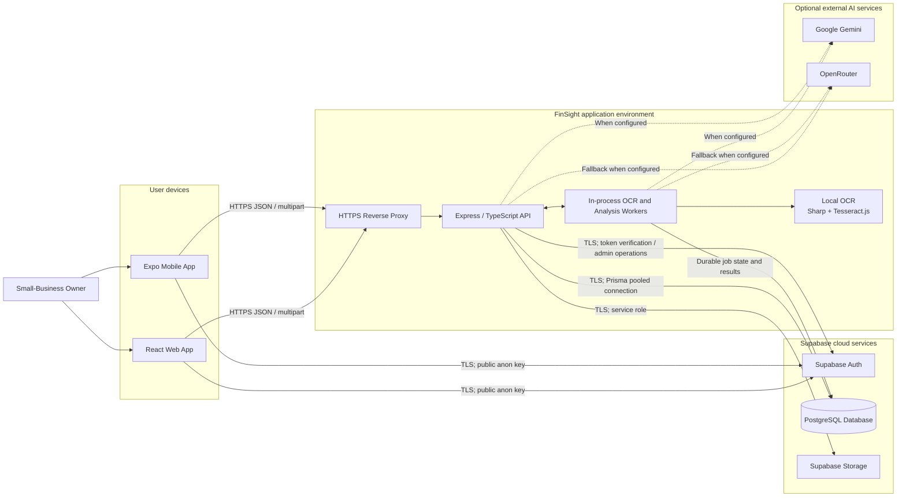

# FinSight Network Model

The diagram below reflects the system implemented in this repository.

## Interpretation

- FinSight has one implemented application role: **Small-Business Owner**. An
  application-administrator role is not implemented.
- The ISP or public internet transports encrypted traffic; it is not an
  application component and does not directly connect the database, OCR, or
  cloud storage.
- Web and mobile clients call the API through HTTPS and also communicate with
  Supabase Auth for user sessions.
- The API is the application boundary for PostgreSQL and Storage access. Client
  applications do not connect directly to application tables or storage using
  privileged credentials.
- OCR runs locally in the backend worker process. Gemini vision may assist with
  difficult receipts when configured; Gemini and OpenRouter are also optional
  providers for AI-assisted explanations.
- Receipt and anomaly jobs are durable in PostgreSQL, but the workers currently
  run inside the backend process rather than on a separate server.

